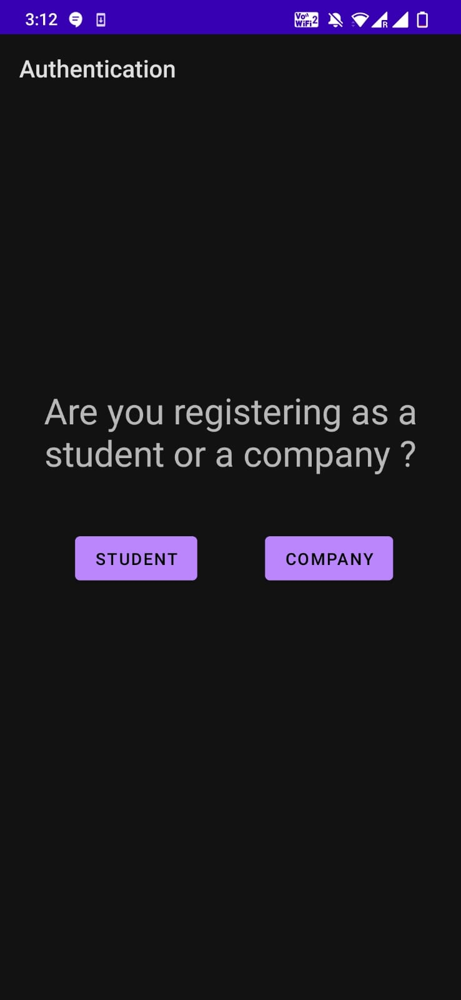

# Placement Portal App

A project done under [CSEA IITG](https://www.facebook.com/iitgcsea/)

## Tech Stack Used

Android Studio, Firebase database.

## Functionality

|             For Students             |          For employers          |
| :----------------------------------: | :-----------------------------: |
|   View opportunities by companies    | Host any type of job/internship |
| Filter by location, minimum CPI, etc | View all applicants in 1 place  |
<!-- |                                      |                                 | -->

## Screenshots
<table style="padding:10px">
  <tr>
    <td> </td>
    <td></td>
    <td></td>
  </tr>
   <tr>
    <td> </td>
    <td></td>
    <td></td>
  </tr>
</table>

## Members

- [Keshav Chourasiya](https://github.com/kchourasiya1108) | [Linkedin](https://www.linkedin.com/in/keshav-chourasiya-1303b31b0/) 
- [Atharva Varde](https://github.com/varde2407) | [Linkedin](https://www.linkedin.com/in/atharva-varde-643a05197/) 
- [Aditya Trivedi](https://github.com/ad1tyat) | [Linkedin](https://www.linkedin.com/in/trivedi-aditya/) 

## TODO

- Improve UI/UX

- For a job, in the list of applicants, see applicant profile
- For a student, see the list of jobs he/she has applied too: 
  - LOGIC : maintain a list of JOBIDs he/she has applied too]
- For a selected student: [Show he/she is selected in Job Status Activity]
  - LOGIC : once selected, automatically removed from all jobs => reflect this in job side logic also
